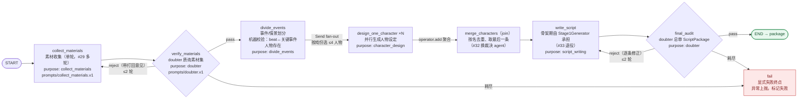

# ADR-0003 剧本生成升级为 LangGraph 多节点 workflow（素材收集/考证/事件划分/人物并行/书写总审）

- 状态：已接受
- 日期：2026-09-20
- 关联：issue #27（spec，grilling 决策记录）、#28（骨架落地）、#29–#34（逐节点深化）；
  取代 `design_06` 实施收敛中「砍 LangGraph、状态机用纯枚举」的裁决；
  参考调研：`docs/research/langgraph-workflow-study.md`（9 个 probe 实测验证）

## 背景

MVP 的 Stage1 生成（`generation/stage1.py`）是「单次 LLM 调用 + 五类校验 + 重试≤2」：
prompt 硬编码、进度仅 4 个粗粒度 phase 且存内存、人物不分层（原文分析出的所有
角色全部进入剧本）。效果升级需要：多轮素材收集与网络考证、独立的事件划分、
主要人物的并行设定、doubter 打回、以及教师分阶段审阅/编辑/指导（spec 见 #27）。
该流程需并行 fan-out、人工闸门、断点恢复——自研状态机与图框架复杂度相当，
而 LangGraph 1.x 的 `interrupt()/Command(resume)` + 持久 checkpointer 直接命中需求。

## 决策

### 1. 剧本生成期 workflow 采用 LangGraph

- 图拓扑（#27 spec）：素材收集 → doubter → 事件划分 → 人物设定（Send fan-out
  每主要人物一个 agent 并行 + merge join）→ 剧本书写 → doubter 总审 → END；
  打回走条件边回环（≤2 次，耗尽显式 fail）。

- 节点**不使用** LangChain ChatModel 抽象调 LLM：直接调用现有 `LLMService`
  （保留 UsageRecorder 计量 / purpose 细分 / 超时与错误码）；结构化输出走
  「prompt + JSON 提取 + Pydantic 校验」（`with_structured_output` 在自定义
  模型上不可用，且 extra=forbid schema 依赖 provider tool-call 质量不稳定）。
- 图编排与 LLM 调用解耦：LangGraph 只做编排，业务依赖经 `WorkflowNodes` 闭包注入。

### 2. 可恢复性：AsyncPostgresSaver 为图状态真源

- 依赖新增 `langgraph-checkpoint-postgres` + `psycopg[binary]`（psycopg 3 连接，
  连接串禁 `+asyncpg` 后缀；saver 自建 `checkpoint*` 四表，不进 Alembic）。
- saver 在 app lifespan 创建并 `setup()`（实例绑定事件循环，不得跨循环复用）；
  PG 不可达时降级为无 checkpointer 运行（闸门恢复待 #34 完整启用）。
- 教师闸门（#34）= 节点产物落库后 `interrupt()`；恢复 = `Command(resume)` +
  `aupdate_state` 注入教师编辑。resume 后节点从头重跑，interrupt 前副作用必须幂等。

### 3. 业务观测与图状态分离

- `script_generations` 表（Alembic 管）：一次生成尝试的观测面——
  status / progress JSONB（NodeProgress + DoubterEvent 快照）/ error / thread_id。
- 对外进度契约 `contracts.generation`（四处单源已同步）：`GenerationStatus`
  （含闸门预留 `awaiting_review`）、`GenerationNode` 六节点枚举、
  `NodeProgress` / `DoubterEvent` / `GenerationProgress`。
- 完整中间产物（素材集/划分草稿/人物草稿）为 backend 内部类型，不进契约；
  教师端先看摘要，按需在 #34 契约化。
- `UsagePurpose` 扩展节点级枚举值（collect_materials/doubter/divide_events/
  character_design/script_writing）。

### 4. prompt 集中管理

- 新建 `backend/app/prompts/`：每节点一个模块，导出 `PROMPT_VERSION` +
  `build_user_message(...)`；prompt_version 逐次可溯源。
- 运行时 Stage2/3 的 prompt（character/verifier）暂维持原状（`agents/` 目录），
  其 fake_llm 关键词路由耦合随 #33 退役时一并处理。

### 5. 测试策略（key-gated）

- 契约/纯逻辑测试（图拓扑、打回路由、Send 并行、进度投影、机器校验）无 key
  全绿：用 tests 内按 purpose 路由的 scripted LLM（开发临时组件，生产不引用）。
- 真实 LLM 链路测试与冒烟：key-gated（无 key `pytest.skip`，同 PG 集成测试先例）；
  完整连通冒烟 `backend/scripts/smoke_workflow.py`。
- **旧路径并存直至 #33**：`ScriptLibrary` 三分支——workflow（组合根启用）/
  旧 Stage1Generator（测试注入 fake LLM）/ 确定性合成（无 key）。#33 退役后两者删除，
  测试同步迁移；届时 AGENTS.md「未配 key 测试全绿」表述按本 ADR 修订。

## 后果

- 单 worker 约束不变（workflow 仍为进程内 asyncio 任务；checkpointer 使重启后
  attempt 状态可追溯，为 #34 断点恢复铺路）。
- `astream(updates, version="v2")` 是进度事件源；不要用 astream_events v3（experimental）。
- 状态 schema 用 TypedDict + Annotated reducers；坏输入会在写 checkpoint 后炸
  （污染 thread），入口校验在 `initial_state` 组装前完成。
- 后续 trigger：#29（多轮素材收集/来源分级）、#30（doubter 框架化）、#31（事件划分深化）、
  #32（人物并行深化/合并裁决）、#33（剧本书写重构 + 旧路径退役）、#34（闸门 UI/API）。
