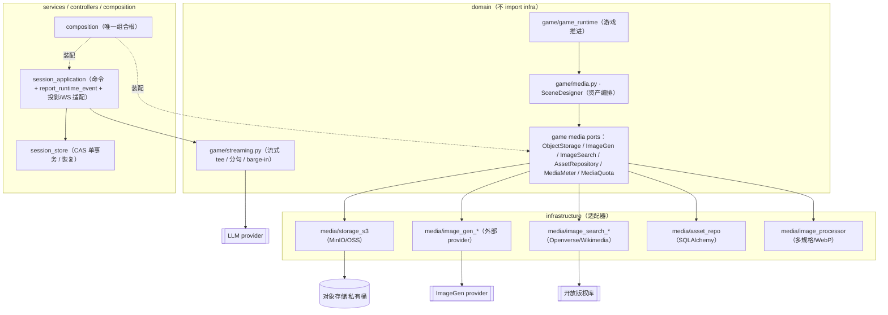
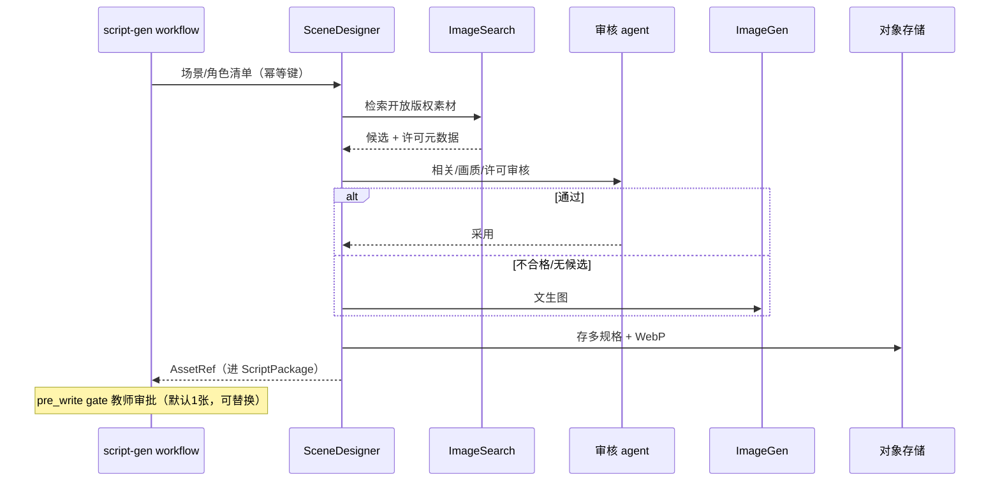
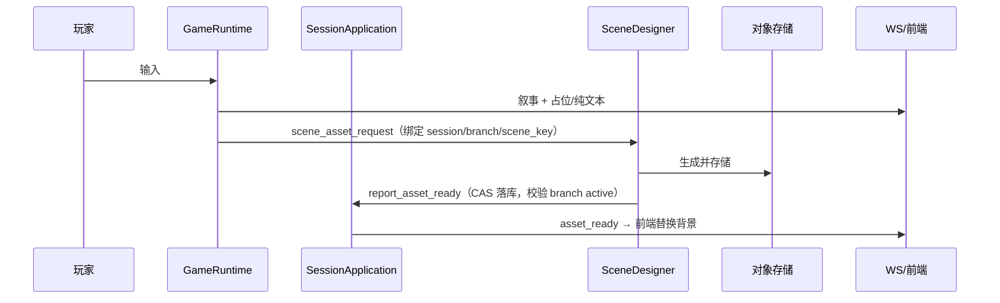

# 文境 — 场景视觉化与多媒体：讨论纪要 + 落地计划

> 状态：设计已确认并经 `codebase-design` 评审修订；**issues 已发布**（epic #38，tickets #39–#64，见文末附录映射）。
> 架构决策见 `docs/adr/0005-media-asset-streaming-architecture.md`；本文件记录讨论过程、
> 现状事实、目标架构、评审修订、里程碑与拟建 issue。执行前请先合并 #36（前置）。
>
> **2026-09-28 更新（ADR-0006）**：组合根已落地为 `app/composition.py`，会话持久化
> （CAS 单事务 / 恢复）已抽为 `services/session_store.py`；下文中 `session_runtime` 的
> 事务/CAS 拼写现由 `SessionStore.commit()` 承担，命令外事件路径直接复用。

## 一、现状事实（代码为准）

- **只有文本 + JSONB 落 PostgreSQL**：全部表非标量即 JSONB，无 `bytea`/附件表
  （`backend/app/infrastructure/models/`）。
- **零对象存储/上传通道**：无 `UploadFile`、无 `StaticFiles`、无 `/files` 路由、
  无 S3/OSS/MinIO SDK；`docker-compose.yml` 仅 `pgdata` 一个卷。
- **"上传素材"实为文本**：前端 `FileReader` 读 `.txt/.md` 后以 JSON 提交
  （`frontend/src/components/teacher/script-create-flow.tsx`、`contracts/material.py:19-31`）。
- **前端无图**：`frontend/public/` 空、`next.config.ts` 无 `images` 配置、
  游玩页是纯文本流 + `react-markdown`（`frontend/src/components/message-stream.tsx`）。
- **契约无视觉字段**：`Scene` 仅 `scene_id/title/participants/beats`
  （`backend/app/contracts/script.py:68-74`）；`CharacterProfile` 无图像/外貌
  （`script.py:48-56`）；`RuntimeState.scene_id` 投影恒 `None`
  （`backend/app/services/session_projection.py:84`）。
- **运行时模型约束（评审关键）**：命令路径无状态、每次从 DB 重建运行时后即弃
  （`services/session_runtime.py`；CAS 单事务见 `services/session_store.py`），
  事件只在命令事务内带 CAS 写入；`project_state`/
  `project_messages` 是纯同步纯函数（`session_projection.py:73-232`）；
  `EventStore.branch_path` 已是分支继承的唯一权威。
- **接缝与调研已有**：`design_07` 预留 `StoragePort`（未实现）；
  `docs/research/jd-cloud-deployment.md:145-146` 结论"后续加图片素材库时开 OSS + 预签名 URL"。

**结论**：现有存储对多媒体**结构性不足**（无通道、无模型、无分发）。

## 二、讨论纪要（grilling 逐轮决策）

| # | 议题 | 决策 |
|---|------|------|
| Q1 | galgame 化程度 | **轻量沉浸 B**：每场景背景图 + 角色头像；契约预留立绘 |
| Q2 | 与 #36 排期 | **等 #36 合并**再加视觉字段 |
| Q3 | 图片来源合规 | **A+B**：平台生成 + 教师上传 + 开放版权库；禁止任意网页抓图 |
| Q4 | 多媒体边界 | **只做静图**，TTS/动效留接口 |
| Q5 | 生图时机 | Stage2 **生成期预生成**；Stage3 **运行期实时生成** |
| Q6 | 审核闸门 | 生成期不介入；script-gen 场景阶段完成后审批；自由探索不审批 |
| Q7 | 抓取 vs 生成 | **开放版权库抓取优先 + 审核 agent**，不合格回退生成；保留纯生成开关 |
| Q8 | 生图 provider | `ImageGenPort` 可插拔，外部 API；背景不含人物、统一画风 |
| Q9 | 存储选型 | **S3 兼容对象存储**（开发 MinIO / 生产 OSS） |
| Q10 | 计量/安全 | 新建 `media_usage`；先计量后配额；安全过滤 + 失败占位 |
| Q11 | 运行期编排 | **引擎中转异步**：新场景 → SceneDesigner 后台生成 → 占位先行 → `asset_ready` |
| Q12 | 运行期场景身份 | `scene_key` 单调分配；回溯继承；缓存去重 |
| Q13 | URL 交付 | **契约存 AssetRef，鉴权端点签发预签名 URL，前端直取** |
| Q14 | 检索源/审核 | **Openverse + Wikimedia**；审核 agent 便宜模型结构化输出；Stage3 只生成 |
| Q15 | 媒体模块架构 | **domain 管 Mgr/接口，infra 放实现** |
| Q16 | 存储访问/处理 | 私有桶 + 预签名；生成时产出多规格 + WebP/AVIF |
| Q17 | 计量模型 | 新建 `media_usage`；**不引入 Mongo** |
| Q18 | 审批 UI | 扩展 **pre_write gate**，每项默认 1 张，可重生成/检索/上传/删除 |
| Q19 | 前端舞台 | 全屏背景 + **屏幕中下方流式字幕**（无气泡），`角色:xxx` |
| Q20 | 资产生命周期 | **发布冻结**；暂不考虑删除回收 |
| Q21 | 术语 | 沿用"编剧 Agent/screenwriter"，新增 **SceneDesigner** |
| Q22 | 来源许可展示 | ~~仅教师端~~ → **修订**：默认免署名许可；需署名许可则学生端折叠署名（§评审 R7） |
| Q23 | 流式语义 | **真 token 流式**（降 TTFT） |
| Q24 | 头像用途 | 主要用于**剧本详情页**；游玩内不显示头像，靠背景图表达场景 |
| Q25 | 旁白/切换 | 旁白居中斜体；场景切换背景淡入 + 短暂场景标题 |
| Q26 | 来源/许可位置 | ~~仅教师端~~ → **修订**：教师端完整；需署名许可时学生端折叠展示 |
| Q27/Q28 | 里程碑/固化 | 按 M0–M6 排序；ADR-0005 + 拆 issues |
| Q29 | 多角色并发 | 增量带 `speaker`，前端按去向路由；音频可并发 |
| Q30 | 流式协议 | 事件流只存最终文本；`stream_*` 瞬态；`resync` 补全；幂等不变 |
| Q31 | LLM 流式端口 | `LLMService.astream` + `WenjingChatModel._astream` |
| Q32 | 流式立项 | **单独立项**，媒体里程碑不依赖 |
| Q33 | 并发字幕 UI | 保留**多行字幕**（上限 3 行）；音频可并发 |
| Q35 | tee/编排位置 | 放 **`domain/game/` 下独立文件** |
| Q36 | ASR 范围 | **只留端口**（延后到 M6 定义） |
| Q37 | 模块位置 | 编排放 `domain/game/` 下不同文件 |
| Q38 | TTS 范围 | **只做端口 + 编排骨架**，实现单独立项 |

## 三、评审修订（`codebase-design`，2026-09-22）

| 编号 | 问题 | 修订 |
|------|------|------|
| R1/B1 | `AssetRef` 定义自相矛盾（含/不含 object_key） | 契约 = `AssetRef{asset_id, kind, status}`；`object_key` 只在 `assets` 表与端口内 |
| R2/B2 | 异步 `asset_ready` 无合法落库路径 | 新增 `SessionApplication.report_runtime_event/report_asset_ready`（经 `SessionStore.commit()` 复用 CAS 拼写）：落库、不带命令、校验 branch active；后台任务不持有 `GameRuntime` |
| R3/B3 | 预签名物化污染纯投影 + 缺授权闸门 | 契约 URL-free；新增鉴权端点 `GET /api/assets/{id}/url`；投影保持纯函数 |
| R4/B4 | 端口漏持久化/计量/配额 | 补 `AssetRepositoryPort` / `MediaMeterPort` / `MediaQuotaPort`（配额在付费调用前） |
| R5/B5 | `scene_id` 修正缺事件侧支撑 | `_RState.scene_key` 进 `export_state`/`restore` 与 `plot_advancement` payload；`_replay_event` 重建 |
| R6/M1 | `runtime_assets` 与 `branch_path` 重复 | 事件为资产继承唯一权威；`runtime_assets` 降级为可重建的非权威索引 |
| R7/M7 | 开放版权署名不能只给教师端 | 默认免署名许可；需署名许可学生端折叠展示；教师上传需审核 |
| R8/M2/M3 | 流式与工具调用 agent 兼容 + TTFT 被抵消 | 只发 `content` 增量、忽略 `tool_call_chunks`、临时文本被最终消息覆盖；确认 reaction 在 propose/verify 之前 |
| R9/M4 | barge-in 与串行命令模型冲突 | barge-in 收敛为客户端停播 + `cancel_audio`，不抢占 LLM |
| R10/M5 | 瞬态流缺取消/背压/终态 | per-connection 流式会话 + 终态规则 + 有限缓冲 + 音频三段协议 |
| R11/M6 | Stage2 资产节点非幂等 | 以 `(script_id, scene_id, purpose, style, provider_version)` 幂等；付费前落意图票据 |
| R12/M8 | 本地开发缺对象存储方案 | compose 加 MinIO + bucket 初始化 + CORS + 内外网 endpoint 分离；测试 key-gated |
| R13/M9 | 成本乘数 | 惰性生成/每剧本上限 + 成本预览 + org 预算与付费前配额闸 |
| R14/M10 | pending 资产崩溃后永挂 | `asset_jobs` 表 + 启动重排 / pending TTL → failed |
| R15/M11 | 投影拿不到当前背景 | `export_state()` 内含 `scene_key` + `current_asset`（引擎内解析） |
| R16/M12/M13 | M2-6 过大、依赖边缺失 | 拆 M2-6 为四张 issue；补 M2→M4、M3-2→M4-2 依赖 |

## 四、目标架构



- **domain** 定义 Mgr/接口与编排；**infra** 实现适配器；**services/controllers** 把 WS/HTTP 适配到端口。
- `SceneDesigner`（`domain/game/media.py`）：检索→审核→回退生成→存储→产出 `AssetRef`。
- 流式编排（`domain/game/streaming.py`）：`LLM 文本流 → {WS 文本消费者, 分句器 → TTS → 音频出口}`。

## 五、数据流

**Stage2（生成期预生成）**



**Stage3（运行期实时生成，命令外事件）**



## 六、数据模型与契约（等 #36 后）

- `AssetRef{asset_id, kind, status}`；`AssetCredit{author, license, source_url, license_url}`。
- `Scene.background_asset: AssetRef | None`。
- `CharacterProfile.avatar_asset / fullbody_asset: AssetRef | None`（详情页用）。
- `RuntimeState`：`scene_id: int | None`（Stage2 脚本场景）+ `scene_key: str | None` +
  `current_asset: AssetRef | None`；`_RState.scene_key` 进 `export_state`/`restore` 与
  `plot_advancement` payload，`_replay_event` 重建。
- `asset_ready` 进 `EventType` + 投影消息类别 + 前端 TS。
- 存储表：
  - `assets`（asset_id、object_key、kind、provider、source、license/author/source_url/license_url、
    hash、尺寸、org、script/session、version、status、created_at）
  - `asset_jobs`（在途生成任务：幂等键、状态、session/branch/scene_key、created_at）
  - `runtime_assets`（**非权威索引**，可从事件重建；若不需要可省）
  - `media_usage`（§七）
- 四处单源：Pydantic → fixtures → jsonschema → 前端 TS；跑 `export_contracts` + `test_contracts.py`。

## 七、存储、计量与安全

- `ObjectStoragePort`（put/presign）+ S3 adapter；开发 MinIO、生产 OSS；私有桶。
- 预签名经鉴权端点签发；前端按过期缓存；多规格由 `ImageProcessor` 产出。
- DB/对象一致性：`pending → 上传 → ready`；崩溃由 `asset_jobs` 恢复。
- `media_usage`：`kind=image|tts|asr`、provider、model、units、size、org/user/script/session、`meta` JSONB。
- 配额：`MediaQuotaPort` 付费调用前 check+consume；`media_usage` 仅 best-effort 计量。
- 安全：provider 审核 + 本地过滤，失败降级占位；每会话生图上限（config）。
- 补充 media 错误域与可观测指标（缓存命中率、生图延迟、失败率、provider 错误）。

## 八、流式与音频（单独立项）

- `LLMService.astream` + `WenjingChatModel._astream`；只发 `content` 增量、忽略 `tool_call_chunks`；
  临时引导语被最终持久消息覆盖；必要时退化两阶段。
- WS 瞬态：`stream_start{stream_id, speaker}` / `stream_delta` / `stream_end`；
  **终态规则**：收到带 seq 的持久 `character_speech` 即丢弃流缓冲。
- per-connection 流式会话：disconnect 即 cancel；有限缓冲 + drop-oldest。
- 音频：`audio_start{track_id,speaker,codec,sample_rate}` → 二进制帧 → `audio_end{track_id}`
  → `cancel_audio{track_id}`；后端中转、不混音、多音轨、客户端 barge-in。
- 多行字幕上限 3 行、到达顺序堆叠、流结束停留 2–3s 淡出、溢出排队。

## 九、里程碑与依赖

```
M0（前置） ──▶ M2 ──▶ M3 ──▶ M4
M1 ──▶ M2
M1 ──▶ M4
M2-1（AssetRef）──▶ M4-1
M2-5（SceneDesigner）──▶ M4-2
M3-2（scene_id/scene_key 修正）──▶ M4-2
M5（独立，不依赖图片）
M6（后续，依赖 M5）
```

- **M0** #36 合并 + 媒体端口骨架
- **M1** 存储与计量基建（含 MinIO 本地开发）
- **M2** 生成期资产（Stage2）
- **M3** 前端沉浸层
- **M4** 运行期 Stage3 生图（含命令外事件路径）
- **M5** 流式（独立）
- **M6** 后续：TTS/ASR

## 十、待定项（非阻塞）

对象存储厂商（OSS vs COS）、ImageGen/Tts provider 选型、开放版权库素材质量评估、
`assets.version` 的 pinned/latest 语义、URL TTL/多规格尺寸、资产生命周期回收、
流式/TTS 用量回报格式。

---

## 附录：已发布 issues

> Epic **#38**；ticket **#39–#64**，均带 `ready-for-agent` 标签与原生 blocked_by 依赖边。
> 执行顺序按依赖前沿推进。M0-1 为既有 issue **#36**（本方案契约前置），不新建。

| 里程碑 | issue |
|--------|-------|
| 媒体端口骨架 M0 | #39 |
| 对象存储 S3/MinIO M1 | #40 |
| media_usage + 配额 M1 | #41 |
| 预签名端点 + 多规格 M1 | #42 |
| 契约 AssetRef M2 | #43 |
| ImageSearch M2 | #44 |
| 图片审核 agent M2 | #45 |
| ImageGen provider M2 | #46 |
| SceneDesigner 编排 M2 | #47 |
| workflow 资产阶段 M2 | #48 |
| 闸门资产通道 M2 | #49 |
| 配图审批 UI M2 | #50 |
| 来源/许可展示 M2 | #51 |
| 游玩页舞台 M3 | #52 |
| scene_key/背景切换 M3 | #53 |
| 详情页资产 M3 | #54 |
| 资产继承权威 M4 | #55 |
| 命令外事件 + 异步 + asset_ready M4 | #56 |
| 上限/过滤/恢复 M4 | #57 |
| LLM 流式 M5 | #58 |
| ChatModel 流式 M5 | #59 |
| WS stream_* 协议 M5 | #60 |
| 前端流式字幕 M5 | #61 |
| tee 骨架 + barge-in M5 | #62 |
| TTS M6 | #63 |
| ASR M6 | #64 |

> 以下正文按设计时的草稿保留，issue 号以上表为准。

### M0 前置

**M0-2 媒体端口骨架（domain 接口 + adapter 空实现）**
- 目标：定义 §四 六个端口与 `domain/game/media.py` 骨架；`infrastructure/media/` 建空实现与配置。
- 验收：`make lint-arch` 通过；端口协议形状单测；无业务接入。
- 依赖：#36。

### M1 存储与计量基建

**M1-1 ObjectStoragePort + S3 adapter + 本地 MinIO**
- 目标：S3 协议 adapter（MinIO/OSS 可切）；compose 加 minio + bucket 初始化 + CORS；
  内外网 endpoint 分离；`scripts/dev.sh` 接入。
- 验收：MinIO 集成测试（上传/预签名可下载）；浏览器可达。

**M1-2 `media_usage` 表 + 计量接缝 + 配额端口**
- 目标：Alembic 迁移 + 模型 + `MediaMeterPort`（best-effort）+ `MediaQuotaPort`（付费前 check+consume）。
- 验收：迁移测试；配额在付费前生效；计量失败不阻断。

**M1-3 预签名鉴权端点 + 图片多规格处理**
- 目标：`GET /api/assets/{id}/url`（校验 actor 归属）；`ImageProcessor` 产出 thumb/medium/original + WebP。
- 验收：越权访问被拒；多规格生成测试。

### M2 生成期资产（Stage2）

**M2-1 契约扩展 AssetRef（breaking）**
- 目标：`AssetRef`/`AssetCredit` + `Scene.background_asset` + `CharacterProfile.avatar/fullbody_asset`；
  四处单源同步。
- 验收：`test_contracts.py` 绿；前端类型可用。
- 依赖：#36。

**M2-2 ImageSearchPort + Openverse/Wikimedia adapter**
- 目标：检索开放版权素材，返回候选 + 许可元数据；SSRF/超时/体积防护。
- 验收：adapter 单测（mock）+ 真实链路 key-gated。

**M2-3 图片审核 agent**
- 目标：便宜模型 + 结构化输出，判"相关/画质/许可"；许可白名单/署名判定。
- 验收：路由与降级测试；token 计量。

**M2-4 ImageGenPort + 首个 provider**
- 目标：外部生图 API adapter；背景 16:9、头像 1:1；安全过滤。
- 验收：adapter 单测 + key-gated 冒烟。

**M2-5 SceneDesigner 编排（幂等 + 缓存 + 存储）**
- 目标：检索→审核→回退生成→存储→`AssetRef`；幂等键与缓存去重（按 org）；付费前意图票据。
- 验收：给定场景产出 `AssetRef`；resume 重跑不重复生成；缓存命中不重复付费。

**M2-6a workflow 资产阶段**
- 目标：script-gen workflow 加资产节点，产出带 `AssetRef` 的 ScriptPackage。
- 验收：端到端生成；幂等；失败降级。
- 依赖：M2-1、M2-5。

**M2-6b GateReview/GateEdits 资产通道 + resume API**
- 目标：闸门契约加资产字段；教师"重新生成/检索/上传/删除"经 resume 生效。
- 验收：契约测试；API 单测。
- 依赖：M2-6a。

**M2-6c 前端配图审批 UI**
- 目标：pre_write gate 场景卡片内配图审批。
- 验收：可替换/重生成/上传；无图降级。
- 依赖：M2-6b。

**M2-6d 来源/许可展示（教师完整；需署名许可学生端折叠）**
- 目标：教师端完整展示；学生端按许可折叠署名。
- 验收：许可白名单与署名规则测试。
- 依赖：M2-1、M2-6b。

### M3 前端沉浸层

**M3-1 游玩页舞台：背景 + 底部多行字幕 + 旁白样式 + 场景淡入**
- 目标：全屏背景铺底；底部字幕 `角色:xxx`（上限 3 行、退场/排队）；旁白居中斜体。
- 验收：视觉验收；无图降级为纯文本；移动端可用。（可提前开工）

**M3-2 `scene_key`/`scene_id` 修正 + 背景切换驱动**
- 目标：`_RState.scene_key` 进状态/事件/重放；`export_state` 解析 `current_asset`；
  投影填充；前端按场景切换背景 + 场景标题。
- 验收：投影/重放测试；切场景背景变化、重连不丢。

**M3-3 剧本详情页资产展示**
- 目标：详情页展示背景/头像/立绘；教师端展示来源与许可。
- 验收：页面验收。

### M4 运行期 Stage3 生图

**M4-1 事件为权威的资产继承 + `scene_key`**
- 目标：资产由 `active_events()` 重放派生；回溯继承；`runtime_assets` 仅作非权威索引。
- 验收：回溯后资产映射正确；重放一致。
- 依赖：M2-1。

**M4-2 命令外事件路径 + 引擎中转异步 + `asset_ready` WS**
- 目标：`report_runtime_event/report_asset_ready`（CAS、不带命令、校验 branch active）；
  占位先行；后台生成；完成推送；前端替换。
- 验收：端到端；并发命令不破 CAS；失败占位不阻塞。
- 依赖：M2-5、M3-2。

**M4-3 配额/上限 + 安全过滤 + 崩溃恢复 + 缓存去重**
- 目标：每会话生图上限；过滤命中丢弃/重生成；`asset_jobs` 启动重排/pending TTL；
  跨会话缓存（按 org）。
- 验收：上限/过滤/恢复测试。

### M5 流式（独立）

**M5-1 `LLMService.astream` + `ChatLLMService` 流式 + 计量**
**M5-2 `WenjingChatModel._astream` + agent 流式（忽略 tool_call_chunks）**
**M5-3 WS `stream_*` 瞬态协议 + 终态规则 + `resync` 兼容 + 取消/背压**
**M5-4 前端字幕流式渲染 + 多轨并发**
**M5-5 `domain/game/streaming.py` tee 骨架（可接 TTS）+ 客户端 barge-in**
- 验收：TTFT 降低；事件流只存最终文本；断线重连补全；临时文本被最终消息覆盖。

### M6 后续

**M6-1 TtsPort 定义 + provider 实现 + 音色映射 + 音频存储/播放 + `media_usage` 音频**
**M6-2 AsrPort 定义 + 学生语音输入**
